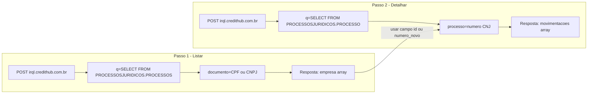

# API Processos Jurídicos — Documentação de Integração

Documentação completa, autoexplicativa e segura com exemplos **mockados**.

> Esta documentação usa dados fictícios. Não expõe informações reais de clientes.
> A API consulta processos judiciais vinculados a um CPF ou CNPJ por meio de queries BPQL no endpoint IRQL.

---

## Visão Geral

A API de **Processos Jurídicos** permite:

| Operação | Query BPQL | O que retorna |
|----------|------------|---------------|
| **Listar processos** | `SELECT FROM 'PROCESSOSJURIDICOS'.'PROCESSOS'` | Lista resumida de processos vinculados ao documento |
| **Consultar movimentações** | `SELECT FROM 'PROCESSOSJURIDICOS'.'PROCESSO'` | Movimentações detalhadas de um processo específico |

### Como se relaciona com outros serviços

| Serviço | O que oferece para processos |
|---------|------------------------------|
| **Esta API** | Lista completa + movimentações detalhadas |
| **Consulta Simples** | Campo `processos` embutido na resposta assíncrona (mesma lista resumida) |
| **Monitore** | Apenas **contagem** de processos (`pdpj`). Veja [API-Monitore.md](API-Monitore.md) |

---

## Autenticação

Todas as requisições exigem o parâmetro `apiKey` com sua chave de API.

```
apiKey=SUA_CHAVE_DE_API
```

- Enviar somente por HTTPS.
- Trate a `apiKey` como segredo. Não versionar em repositórios públicos.

---

## URL Base e Formato

```
https://irql.credithub.com.br
```

| Item | Valor |
|------|-------|
| Método HTTP | `POST` ou `GET` |
| Content-Type | `application/x-www-form-urlencoded` |
| Parâmetro de query | `q` — comando BPQL |
| Demais parâmetros | Query string ou body (form-urlencoded) |

---

## Fluxo de Integração Recomendado



1. **Listar** processos com `PROCESSOS` + `documento` (CPF ou CNPJ).
2. Percorrer o array `empresa` e escolher o processo desejado pelo campo `id` ou `numero_novo`.
3. **Consultar movimentações** com `PROCESSO` + `processo` (número CNJ).
4. Tratar `empresa: []` como ausência de processos — não é erro.
5. Processos sigilosos têm `id` contendo `"processo sigiloso"` — a consulta de detalhe não está disponível para esses casos.

---

## 1. Listar Processos por Documento

Retorna a lista resumida de processos judiciais vinculados a um CPF ou CNPJ.

### Requisição

| Parâmetro | Tipo | Obrigatório | Descrição |
|-----------|------|:-----------:|-----------|
| `apiKey` | string | ✅ | Chave de autenticação |
| `q` | string | ✅ | `SELECT FROM 'PROCESSOSJURIDICOS'.'PROCESSOS'` |
| `documento` | string | ✅ | CPF (11 dígitos) ou CNPJ (14 dígitos), com ou sem máscara |
| `ctime` | string | ❌ | Data de cache no formato `YYYY-MM-DD` (cache válido por 1 dia) |

### Exemplo cURL

```bash
curl -X POST "https://irql.credithub.com.br" \
  -H "Content-Type: application/x-www-form-urlencoded" \
  --data-urlencode "apiKey=SUA_CHAVE_DE_API" \
  --data-urlencode "q=SELECT FROM 'PROCESSOSJURIDICOS'.'PROCESSOS'" \
  --data-urlencode "documento=12345678000199"
```

### Exemplo com cache

```bash
curl -X POST "https://irql.credithub.com.br" \
  -H "Content-Type: application/x-www-form-urlencoded" \
  --data-urlencode "apiKey=SUA_CHAVE_DE_API" \
  --data-urlencode "q=SELECT FROM 'PROCESSOSJURIDICOS'.'PROCESSOS'" \
  --data-urlencode "documento=12345678000199" \
  --data-urlencode "ctime=2026-06-05"
```

### Exemplos em outras linguagens

#### JavaScript com `fetch`

```js
const params = new URLSearchParams({
  apiKey: process.env.CREDITHUB_API_KEY,
  q: "SELECT FROM 'PROCESSOSJURIDICOS'.'PROCESSOS'",
  documento: "12345678000199",
});

const res = await fetch("https://irql.credithub.com.br/", {
  method: "POST",
  headers: { "Content-Type": "application/x-www-form-urlencoded" },
  body: params,
});

if (!res.ok) throw new Error(`HTTP ${res.status}`);
const data = await res.json();
console.log(data);
```

#### Python com `requests`

```python
import os
import requests

payload = {
    "apiKey": os.environ["CREDITHUB_API_KEY"],
    "q": "SELECT FROM 'PROCESSOSJURIDICOS'.'PROCESSOS'",
    "documento": "12345678000199",
}

r = requests.post("https://irql.credithub.com.br/", data=payload, timeout=30)
r.raise_for_status()
data = r.json()
print(data)
```

#### PHP com `curl`

```php
<?php
$payload = http_build_query([
    'apiKey' => getenv('CREDITHUB_API_KEY'),
    'q' => "SELECT FROM 'PROCESSOSJURIDICOS'.'PROCESSOS'",
    'documento' => '12345678000199',
]);

$ch = curl_init("https://irql.credithub.com.br/");
curl_setopt_array($ch, [
    CURLOPT_POST => true,
    CURLOPT_POSTFIELDS => $payload,
    CURLOPT_RETURNTRANSFER => true,
    CURLOPT_HTTPHEADER => ['Content-Type: application/x-www-form-urlencoded'],
    CURLOPT_TIMEOUT => 30,
]);

$response = curl_exec($ch);
if ($response === false) {
    throw new RuntimeException(curl_error($ch));
}
$httpCode = curl_getinfo($ch, CURLINFO_HTTP_CODE);
curl_close($ch);

if ($httpCode !== 200) {
    throw new RuntimeException("HTTP $httpCode: $response");
}

$data = json_decode($response, true);
print_r($data);
```

### Resposta de Sucesso (mockada)

```json
{
  "empresa": [
    {
      "id": "00009938820178260247",
      "numero_novo": "00009938820178260247",
      "numero_antigo": null,
      "created_at": null,
      "updated_at": "2024-03-15T10:30:00+00:00",
      "tipo_envolvido": null,
      "diario_sigla": "TJSP",
      "diario_nome": null,
      "estado": "SP",
      "data_movimentacoes": null,
      "quantidade_movimentacoes": null,
      "classe_processual": "Procedimento Comum Cível",
      "assuntos": "Protesto Indevido | Liminar",
      "envolvidos_ultima_movimentacao": [
        {
          "nome": "EMPRESA EXEMPLO LTDA",
          "nome_sem_filtro": "EMPRESA EXEMPLO LTDA",
          "envolvido_tipo": "Ativo",
          "envolvido_extra_nome": null,
          "oab": null,
          "advogado_de": null
        },
        {
          "nome": "DR. JOÃO ADVOGADO",
          "nome_sem_filtro": "DR. JOÃO ADVOGADO",
          "envolvido_tipo": "Advogado",
          "envolvido_extra_nome": null,
          "oab": null,
          "advogado_de": "EMPRESA EXEMPLO LTDA"
        }
      ]
    }
  ],
  "homonimos": []
}
```

### Resposta sem processos

```json
{
  "empresa": [],
  "homonimos": []
}
```

### Resposta com aviso (`_warning`)

Em alguns casos, a resposta pode incluir o campo `_warning`:

```json
{
  "empresa": [ ... ],
  "homonimos": [],
  "_warning": "Dados obtidos por meio de diários oficiais."
}
```

### Campos da resposta (nível raiz)

| Campo | Tipo | Descrição |
|-------|------|-----------|
| `empresa` | array | Lista de processos vinculados ao documento consultado |
| `homonimos` | array | Entidades com nome semelhante encontradas. Pode estar vazio |
| `_warning` | string | Aviso opcional. Quando presente, contém: `"Dados obtidos por meio de diários oficiais."` |

### Campos de cada item em `empresa`

| Campo | Tipo | Descrição |
|-------|------|-----------|
| `id` | string | Identificador do processo (número CNJ). Use este valor na consulta de movimentações |
| `numero_novo` | string | Número CNJ do processo |
| `numero_antigo` | string \| null | Número antigo do processo, se houver |
| `created_at` | string \| null | Data de criação do registro |
| `updated_at` | string \| null | Data da última movimentação (formato ISO 8601) |
| `tipo_envolvido` | string \| null | Tipo de envolvimento do consultado no processo |
| `diario_sigla` | string | Sigla do tribunal (ex: `TJSP`, `TJRJ`) |
| `diario_nome` | string \| null | Nome completo do diário/tribunal |
| `estado` | string | UF do tribunal (ex: `SP`, `RJ`) |
| `data_movimentacoes` | string \| null | Data das movimentações |
| `quantidade_movimentacoes` | string \| null | Quantidade de movimentações registradas |
| `classe_processual` | string | Classe processual do processo |
| `assuntos` | string | Assuntos separados por ` \| ` |
| `envolvidos_ultima_movimentacao` | array | Partes e advogados da última movimentação |

### Campos de `envolvidos_ultima_movimentacao`

| Campo | Tipo | Descrição |
|-------|------|-----------|
| `nome` | string | Nome do envolvido |
| `nome_sem_filtro` | string | Nome sem filtros aplicados |
| `envolvido_tipo` | string | `Ativo`, `Passivo` ou `Advogado` |
| `envolvido_extra_nome` | string \| null | Nome adicional do envolvido |
| `oab` | string \| null | Número da OAB (advogados) |
| `advogado_de` | string \| null | Nome da parte representada (quando `envolvido_tipo` é `Advogado`) |

---

## 2. Consultar Movimentações de um Processo

Retorna o histórico de movimentações de um processo específico pelo número CNJ.

> **Cobrança:** Esta operação consome **1000 créditos iCheques** por consulta.

### Requisição

| Parâmetro | Tipo | Obrigatório | Descrição |
|-----------|------|:-----------:|-----------|
| `apiKey` | string | ✅ | Chave de autenticação |
| `q` | string | ✅ | `SELECT FROM 'PROCESSOSJURIDICOS'.'PROCESSO'` |
| `processo` | string | ✅ | Número CNJ do processo (com ou sem máscara; o backend remove caracteres não numéricos) |

### Exemplo cURL

```bash
curl -X POST "https://irql.credithub.com.br" \
  -H "Content-Type: application/x-www-form-urlencoded" \
  --data-urlencode "apiKey=SUA_CHAVE_DE_API" \
  --data-urlencode "q=SELECT FROM 'PROCESSOSJURIDICOS'.'PROCESSO'" \
  --data-urlencode "processo=00009938820178260247"
```

### Exemplos em outras linguagens

#### JavaScript com `fetch`

```js
const params = new URLSearchParams({
  apiKey: process.env.CREDITHUB_API_KEY,
  q: "SELECT FROM 'PROCESSOSJURIDICOS'.'PROCESSO'",
  processo: "00009938820178260247",
});

const res = await fetch("https://irql.credithub.com.br/", {
  method: "POST",
  headers: { "Content-Type": "application/x-www-form-urlencoded" },
  body: params,
});

if (!res.ok) throw new Error(`HTTP ${res.status}`);
const movimentacoes = await res.json();
console.log(movimentacoes);
```

#### Python com `requests`

```python
import os
import requests

payload = {
    "apiKey": os.environ["CREDITHUB_API_KEY"],
    "q": "SELECT FROM 'PROCESSOSJURIDICOS'.'PROCESSO'",
    "processo": "00009938820178260247",
}

r = requests.post("https://irql.credithub.com.br/", data=payload, timeout=30)
r.raise_for_status()
movimentacoes = r.json()
print(movimentacoes)
```

### Resposta de Sucesso (mockada)

A resposta é um **array** de movimentações, ordenadas da mais recente para a mais antiga.

```json
[
  {
    "id": null,
    "secao": "1º Grau - 1ª Vara Cível",
    "texto_categoria": "",
    "diario_oficial_id": null,
    "processo_id": null,
    "pagina": null,
    "complemento": null,
    "tipo": null,
    "classe_processual": "Procedimento Comum Cível",
    "assuntos": "Protesto Indevido | Liminar",
    "subtipo": null,
    "conteudo": "Distribuído por sorteio",
    "snippet": "Distribuído por sorteio",
    "data": "2024-01-15T14:00:00+00:00",
    "letras_processo": null,
    "subprocesso": null,
    "created_at": null,
    "updated_at": null,
    "descricao_pequena": "Movimentação do processo 00009938820178260247",
    "diario_oficial": "15/01/2024 | TJSP - 1º Grau",
    "estado": null,
    "envolvidos": [
      {
        "nome": "EMPRESA EXEMPLO LTDA",
        "nome_sem_filtro": "EMPRESA EXEMPLO LTDA",
        "envolvido_tipo": "ATIVO",
        "envolvido_extra_nome": null,
        "oab": null,
        "advogado_de": null
      },
      {
        "nome": "DR. JOÃO ADVOGADO",
        "nome_sem_filtro": "DR. JOÃO ADVOGADO",
        "envolvido_tipo": "Advogado",
        "envolvido_extra_nome": null,
        "oab": "SP123456",
        "advogado_de": "EMPRESA EXEMPLO LTDA"
      }
    ],
    "link": null,
    "link_api": null,
    "link_pdf": null,
    "link_pdf_api": null,
    "data_formatada": "15/01/2024",
    "objeto_type": "Movimentacao",
    "diario": []
  },
  {
    "id": null,
    "secao": "1º Grau - 1ª Vara Cível",
    "conteudo": "Juntada de petição inicial",
    "data": "2024-01-10T09:30:00+00:00",
    "data_formatada": "10/01/2024",
    "classe_processual": "Procedimento Comum Cível",
    "assuntos": "Protesto Indevido | Liminar",
    "diario_oficial": "10/01/2024 | TJSP - 1º Grau",
    "envolvidos": [],
    "objeto_type": "Movimentacao"
  }
]
```

### Campos principais de cada movimentação

| Campo | Tipo | Descrição |
|-------|------|-----------|
| `secao` | string | Grau e órgão julgador (ex: `1º Grau - 1ª Vara Cível`) |
| `conteudo` | string | Descrição da movimentação |
| `data` | string | Data e hora no formato ISO 8601 |
| `data_formatada` | string | Data no formato `dd/MM/yyyy` |
| `classe_processual` | string | Classe processual do processo |
| `assuntos` | string | Assuntos separados por ` \| ` |
| `diario_oficial` | string | Data, tribunal e grau formatados |
| `envolvidos` | array | Partes e advogados do processo |
| `objeto_type` | string | Sempre `"Movimentacao"` |
| `descricao_pequena` | string | Resumo da movimentação |

### Campos de `envolvidos` (movimentações)

| Campo | Tipo | Descrição |
|-------|------|-----------|
| `nome` | string | Nome do envolvido |
| `envolvido_tipo` | string | `ATIVO`, `PASSIVO`, `Advogado` ou `Parte` |
| `oab` | string \| null | Número da OAB (advogados) |
| `advogado_de` | string \| null | Parte representada pelo advogado |

> **Nota:** Na listagem (`PROCESSOS`), `envolvido_tipo` usa `Ativo`/`Passivo`. Na consulta de movimentações (`PROCESSO`), os valores podem vir como `ATIVO`/`PASSIVO`.

---

## Formato do Documento e do Processo

### Documento (CPF/CNPJ)

| Formato | Exemplo | Válido |
|---------|---------|:------:|
| CPF sem máscara | `12345678901` | ✅ |
| CPF com máscara | `123.456.789-01` | ✅ |
| CNPJ sem máscara | `12345678000199` | ✅ |
| CNPJ com máscara | `12.345.678/0001-99` | ✅ |

### Número do processo (CNJ)

| Formato | Exemplo | Válido |
|---------|---------|:------:|
| Apenas dígitos | `00009938820178260247` | ✅ |
| Com máscara CNJ | `0000993-88.2017.8.26.0247` | ✅ |

> Internamente, o sistema remove qualquer caractere não numérico.

---

## Boas Práticas de Integração

1. **Normalização de documento**
   Aceitamos com ou sem máscara. Para consistência, normalize internamente removendo não dígitos antes de salvar em seu banco.

2. **Cache com `ctime`**
   Use `ctime=YYYY-MM-DD` para reutilizar resultados do mesmo dia e evitar consultas repetidas. O cache tem validade de 1 dia.

3. **Fluxo em duas etapas**
   Sempre liste primeiro com `PROCESSOS` e só então consulte movimentações com `PROCESSO`. A consulta de detalhe é cobrada separadamente.

4. **Resiliência**
   Implemente `timeout` de 30 s e uma política de retry leve para erros transitórios 5xx. Evite retries para 4xx.

5. **Não confundir com Monitore**
   O campo `pdpj` do Monitore retorna apenas a **quantidade** de processos. Para obter a lista e detalhes, use esta API.

6. **Observabilidade**
   Logue `documento` normalizado, `processo`, status HTTP, latência e hash da resposta para deduplicação.

---

## Erros Comuns

| HTTP | Causa | Ação sugerida |
|------|-------|---------------|
| 400 | Parâmetros ausentes ou malformados | Verifique `apiKey`, `q` e `documento`/`processo` |
| 401 | `apiKey` ausente ou inválida | Reenvie com chave válida |
| 403 | Permissão insuficiente | Contate o administrador para habilitar acesso a processos jurídicos |
| 404 | Rota não encontrada | Verifique a URL base e método |
| 429 | Limite de taxa atingido | Aplique backoff exponencial |
| 500 | Erro interno | Tente novamente e monitore |
| 503 | Serviço indisponível momentaneamente | Retry com jitter |

### Códigos de erro BPQL

| Código | Descrição |
|--------|-----------|
| `AUTHENTICATION_FAILURE` | Chave de API inválida ou contrato não suportado |
| `MISSING_ARGUMENT` | Parâmetro obrigatório não enviado (ex: `documento`, `processo`) |
| `INVALID_ARGUMENT` | Documento com formato inválido (deve ter 11 ou 14 dígitos) |
| `EXPECTED_DATA_NOT_FOUND` | Processo não encontrado |

### Exemplo de resposta de erro (XML)

```xml
<?xml version="1.0" encoding="UTF-8"?>
<BPQL>
  <header>
    <exception>Parâmetro necessário - documento</exception>
    <code>MISSING_ARGUMENT</code>
  </header>
</BPQL>
```

### Causas comuns de 403

- Conta sem permissão para consulta de processos jurídicos
- Subconta sem acesso habilitado a este serviço

---

## Resumo Rápido

| Operação | Query (`q`) | Parâmetros |
|----------|-------------|------------|
| **Listar processos** | `SELECT FROM 'PROCESSOSJURIDICOS'.'PROCESSOS'` | `documento`, `ctime` (opcional) |
| **Consultar movimentações** | `SELECT FROM 'PROCESSOSJURIDICOS'.'PROCESSO'` | `processo` |

---

## Exemplo Completo de Integração

### 1. Listar processos de um CNPJ

```bash
curl -X POST "https://irql.credithub.com.br" \
  -d "apiKey=SUA_CHAVE_DE_API" \
  -d "q=SELECT FROM 'PROCESSOSJURIDICOS'.'PROCESSOS'" \
  -d "documento=12345678000199"
```

### 2. Consultar movimentações do primeiro processo retornado

```bash
curl -X POST "https://irql.credithub.com.br" \
  -d "apiKey=SUA_CHAVE_DE_API" \
  -d "q=SELECT FROM 'PROCESSOSJURIDICOS'.'PROCESSO'" \
  -d "processo=00009938820178260247"
```

---

## Especificação OpenAPI 3.0

> Copie e cole em Swagger Editor, Redocly ou Postman. Os exemplos abaixo são fictícios.

```yaml
openapi: 3.0.3
info:
  title: Processos Jurídicos API
  version: "1.0.0"
  description: >
    Consulta processos judiciais por CPF/CNPJ e movimentações por número CNJ.
    Exemplos mockados para evitar exposição de dados reais.
servers:
  - url: https://irql.credithub.com.br
tags:
  - name: ProcessosJuridicos
paths:
  /:
    post:
      tags: [ProcessosJuridicos]
      operationId: processosJuridicosQuery
      summary: Executa query BPQL de Processos Jurídicos
      requestBody:
        required: true
        content:
          application/x-www-form-urlencoded:
            schema:
              oneOf:
                - $ref: "#/components/schemas/ListarProcessosRequest"
                - $ref: "#/components/schemas/ConsultarMovimentacoesRequest"
            examples:
              listar:
                summary: Listar processos por documento
                value:
                  apiKey: "<YOUR_API_KEY>"
                  q: "SELECT FROM 'PROCESSOSJURIDICOS'.'PROCESSOS'"
                  documento: "12.345.678/0001-99"
              detalhar:
                summary: Consultar movimentações
                value:
                  apiKey: "<YOUR_API_KEY>"
                  q: "SELECT FROM 'PROCESSOSJURIDICOS'.'PROCESSO'"
                  processo: "00009938820178260247"
      responses:
        "200":
          description: Sucesso
          content:
            application/json:
              schema:
                oneOf:
                  - $ref: "#/components/schemas/ListarProcessosResponse"
                  - $ref: "#/components/schemas/MovimentacoesResponse"
        "400": { description: Requisição inválida }
        "401": { description: Não autorizado }
        "403": { description: Permissão insuficiente }
        "500": { description: Erro interno }
      security:
        - ApiKeyQuery: []
components:
  securitySchemes:
    ApiKeyQuery:
      type: apiKey
      in: query
      name: apiKey
  schemas:
    ListarProcessosRequest:
      type: object
      required: [apiKey, q, documento]
      properties:
        apiKey:
          type: string
        q:
          type: string
          enum: ["SELECT FROM 'PROCESSOSJURIDICOS'.'PROCESSOS'"]
        documento:
          type: string
          example: "12345678000199"
        ctime:
          type: string
          example: "2026-06-05"
    ConsultarMovimentacoesRequest:
      type: object
      required: [apiKey, q, processo]
      properties:
        apiKey:
          type: string
        q:
          type: string
          enum: ["SELECT FROM 'PROCESSOSJURIDICOS'.'PROCESSO'"]
        processo:
          type: string
          example: "00009938820178260247"
    Envolvido:
      type: object
      properties:
        nome: { type: string }
        nome_sem_filtro: { type: string }
        envolvido_tipo: { type: string }
        oab: { type: string, nullable: true }
        advogado_de: { type: string, nullable: true }
    ProcessoResumo:
      type: object
      properties:
        id: { type: string }
        numero_novo: { type: string }
        numero_antigo: { type: string, nullable: true }
        updated_at: { type: string, nullable: true }
        diario_sigla: { type: string }
        estado: { type: string }
        classe_processual: { type: string }
        assuntos: { type: string }
        envolvidos_ultima_movimentacao:
          type: array
          items:
            $ref: "#/components/schemas/Envolvido"
    ListarProcessosResponse:
      type: object
      properties:
        empresa:
          type: array
          items:
            $ref: "#/components/schemas/ProcessoResumo"
        homonimos:
          type: array
          items: { type: object }
        _warning:
          type: string
    Movimentacao:
      type: object
      properties:
        secao: { type: string }
        conteudo: { type: string }
        data: { type: string }
        data_formatada: { type: string }
        classe_processual: { type: string }
        assuntos: { type: string }
        diario_oficial: { type: string }
        envolvidos:
          type: array
          items:
            $ref: "#/components/schemas/Envolvido"
        objeto_type: { type: string, example: "Movimentacao" }
    MovimentacoesResponse:
      type: array
      items:
        $ref: "#/components/schemas/Movimentacao"
```

---

## Versionamento

- `v1.0.0` — Primeira versão pública da documentação de Processos Jurídicos (listagem + movimentações).

---

**Dúvidas?** Entre em contato com o suporte CreditHub em contato@credithub.com.br.
